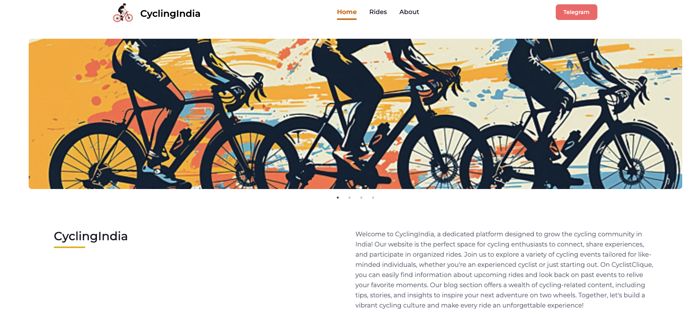
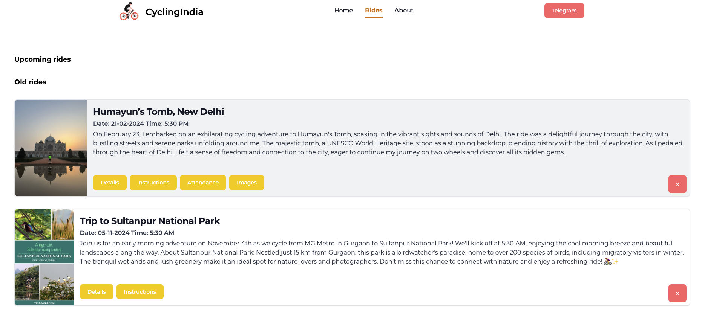
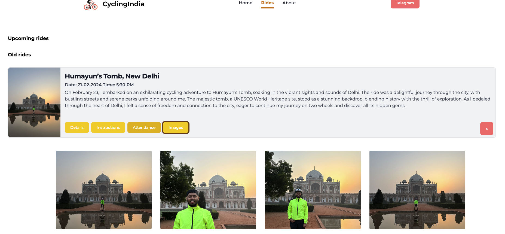
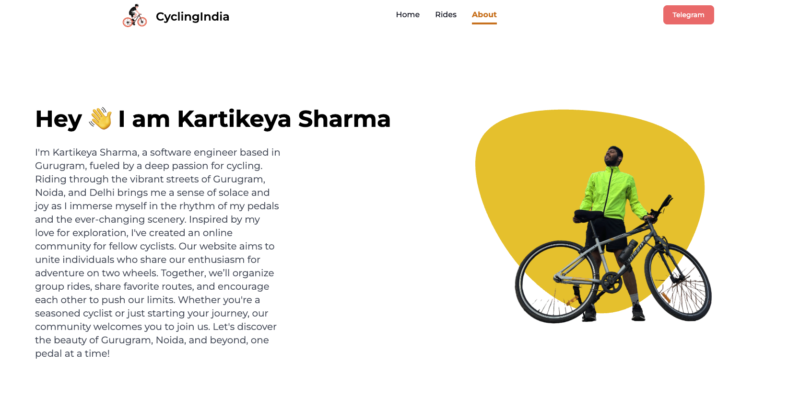
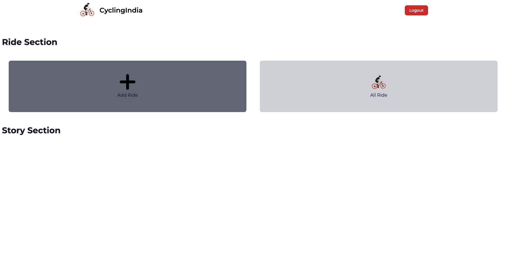

# 🚴‍♂️ CyclingIndia

## 🧠 Project Idea

This platform is designed to **inspire youth to stay active** and build a strong **cycling community across India**. It allows riders to **host and join cycling events**, making it easier to connect with like-minded people across regions. The goal is to make community cycling accessible, scalable, and social.

---

## 🌐 Website

[Live Website](https://cyclingindia.web.app/)

---

## ✨ Features

- View and join upcoming cycling rides based on your location.
- Community-based model where trusted users are promoted to **admins**.
- Admins can host rides that are visible to all nearby users.
- Encourages physical fitness, travel, and community bonding through cycling.
- Mobile-friendly and accessible across devices.

---

## 🎯 Goals

- Promote an **active lifestyle** and **mental well-being**.
- Create a **nationwide network of cycling enthusiasts**.
- Encourage **local leadership** by enabling trusted users to host rides in their regions.
- Make ride discovery and coordination simple and seamless.

---

## 🖼️ Images







---

## 🛠️ Tech Stack

- **Frontend:** React
- **Backend & Hosting:** Firebase
- **Authentication & Database:** Firebase Auth & Firestore

---

## 🔐 Admin Panel

- [Admin Panel URL](https://cyclingindia.web.app/admin-panel)
- **Email:** `workwithkartikeyasharma@gmail.com`
- **Password:** `Kartik14#@`

> Credentials are for demo purposes only. Please change them before production use.

---

## 🛠️ Local Setup

1. **Clone the repository**
   ```bash
   git clone https://github.com/your-username/cyclingindia.git
   cd cyclingindia

1. **Install dependencies**
   ```bash
   npm install

1. **Run project**
   ```bash
   npm install

1. **Deployment**
   ```bash
   Firebase login
   Firebase deploy